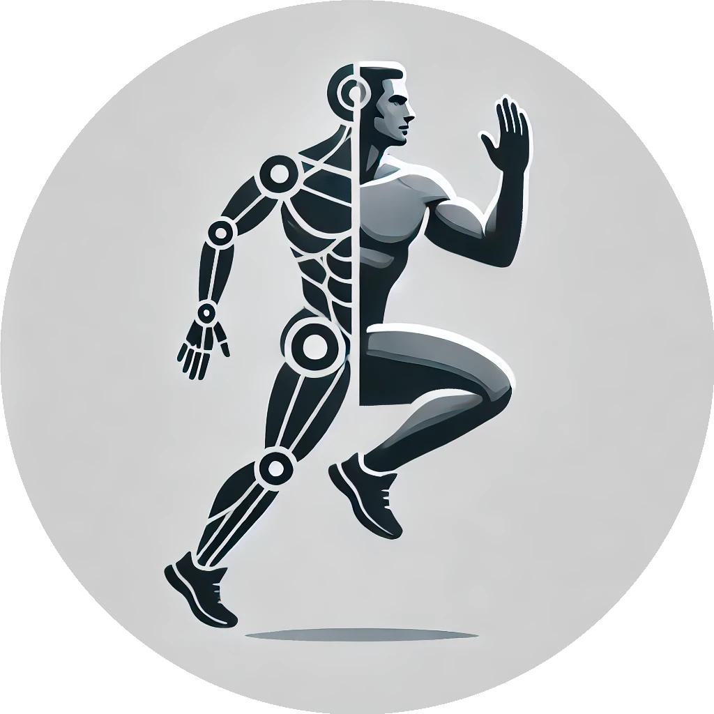

# Awesome Digital Twins in Sport [](https://awesome.re)

<p align="center">
  
</p>

A curated collection of research and resources on digital twins in sport. It brings together core digital-twin studies and the interdisciplinary methods that support athlete modelling, performance analysis, injury prevention, training optimisation, sports education, robotics, and venue management.

The collection intentionally includes both direct digital-twin implementations and enabling research. Each entry explains its role so readers can distinguish between the two.

## Contents

- [Books](#books)
- [Surveys and Reviews](#surveys-and-reviews)
- [Research](#research)
  - [Athlete Performance, Health, and Injury](#athlete-performance-health-and-injury)
  - [Coaching, Training, and Education](#coaching-training-and-education)
  - [Teams, Robotics, and Sports Facilities](#teams-robotics-and-sports-facilities)
  - [Related and Enabling Research](#related-and-enabling-research)
- [Theses and Dissertations](#theses-and-dissertations)
- [Perspectives](#perspectives)
- [Datasets](#datasets)
- [Software](#software)
- [Citation](#citation)

## Books

- Blondin, Maude J., Iztok Fister Jr., and Panos M. Pardalos, editors. “[Artificial Intelligence, Optimization, and Data Sciences in Sports](https://doi.org/10.1007/978-3-031-76047-1).” *Springer*, 2025. — A broad reference on AI and optimisation in sport that includes a dedicated digital-twin chapter.
- Dhanaraj, Rajesh Kumar, R. Balasubramanian, and Gopalakrishnan Kumar, editors. “[Digital Twin Technologies for Healthcare 4.0](https://shop.theiet.org/digital-twin-technologies-for-healthcare-4-0).” *The Institution of Engineering and Technology*, 2022. — Provides healthcare digital-twin foundations that transfer to athlete health and well-being applications.
- Lv, Zhihan, and Elena Fersman. “[Digital Twin: Basics and Applications](https://doi.org/10.1007/978-3-031-11401-4).” *Springer*, 2022. — Introduces digital-twin concepts and application patterns used across the research collected here.

## Surveys and Reviews

- Amawi, Adam Tawfiq, et al. “[Digital Twin for Taekwondo Athletes: Integrating Sports Nutrition and Psychological Readiness Using Artificial Intelligence](https://doi.org/10.3389/fpubh.2026.1822194).” *Frontiers in Public Health*, vol. 14, 2026, article 1822194. — Proposes a Taekwondo-focused framework combining nutrition, psychological readiness, and AI within an athlete digital twin.
- Baca, Arnold, et al. “[Integration of Digital Tools in Training and Sports Education](https://doi.org/10.1007/978-981-97-2898-5_15).” *Proceedings of the 14th International Symposium on Computer Science in Sport*, Springer, 2024, pp. 147–153. — Surveys digital tools that provide an enabling context for digital-twin-supported training and education.
- Barricelli, Barbara Rita, Federico Cerutti, and Stefano Morzenti. “[Human Digital Twins in Sports and Rehabilitation: A Systematic Review](https://doi.org/10.1080/0144929X.2026.2660222).” *Behaviour & Information Technology*, 2026, pp. 1–22. — Systematically maps human digital twins across sport and rehabilitation and identifies design and validation gaps.
- Cheng, Ming-Yang, et al. “[Evaluating EEG Neurofeedback in Sport Psychology: A Systematic Review of RCT Studies for Insights into Mechanisms and Performance Improvement](https://doi.org/10.3389/fpsyg.2024.1331997).” *Frontiers in Psychology*, vol. 15, 2024, article 1331997. — Reviews EEG neurofeedback evidence relevant to the sensing and feedback layers of athlete twins.
- Cossich, Victor R. A., et al. “[Technological Breakthroughs in Sport: Current Practice and Future Potential of Artificial Intelligence, Virtual Reality, Augmented Reality, and Modern Data Visualization in Performance Analysis](https://doi.org/10.3390/app132312965).” *Applied Sciences*, vol. 13, no. 23, 2023, article 12965. — Places digital twins within the wider technology landscape for sports performance analysis.
- Gámez Díaz, Rogelio, Qingtian Yu, et al. “[Digital Twin Coaching for Physical Activities: A Survey](https://doi.org/10.3390/s20205936).” *Sensors*, vol. 20, no. 20, 2020, article 5936. — Surveys architectures and technologies for digital-twin coaching of physical activity.
- Ghatti, Siddharth, et al. “[Digital Twins in Healthcare: A Survey of Current Methods](https://doi.org/10.26502/acbr.50170352).” *Archives of Clinical and Biomedical Research*, vol. 7, no. 3, 2023. — Summarises healthcare digital-twin methods relevant to athlete monitoring and personalised care.
- Hliš, Tilen, Iztok Fister, and Iztok Fister Jr. “[Digital Twins in Sport: Concepts, Taxonomies, Challenges and Practical Potentials](https://doi.org/10.1016/j.eswa.2024.125104).” *Expert Systems with Applications*, vol. 258, 2024, article 125104. — Establishes a sport-specific taxonomy and research agenda for digital twins.
- Lauer-Schmaltz, Martin Wolfgang, et al. “[Towards the Human Digital Twin: Definition and Design—A Survey](https://doi.org/10.48550/arXiv.2402.07922).” *arXiv*, 2024. — Clarifies human digital-twin definitions and design dimensions that underpin athlete-centred systems.
- Pascual, Heribert, et al. “[A Systematic Review on Human Modeling: Digging into Human Digital Twin Implementations](https://doi.org/10.48550/arXiv.2302.03593).” *arXiv*, 2023. — Reviews implementation approaches for human models used as a foundation for athlete twins.
- Rudyanto, Rudyanto, Anisa Sholiha Mia, and Vega Soniawan. “[Digital Twin Applications in Athlete Performance Monitoring, Biomechanical Analysis, and Injury Prevention: Implications for Volleybal](https://doi.org/10.29210/30036843000).” *JRTI (Jurnal Riset Tindakan Indonesia)*, vol. 11, no. 1, 2026, pp. 147–160. — Reviews digital-twin research relevant to volleyball and identifies the lack of direct volleyball-specific validation.
- Sédiri, Afef, et al. “[Digital Twins in Sports Science: Applications for Performance Enhancement, Injury Prevention, and Rehabilitation through Advanced Big Data Analytics and Deep Learning Methodologies—A Comprehensive Narrative Review](https://doi.org/10.5114/biolsport.2026.161106).” *Biology of Sport*, vol. 43, no. 1, 2026, pp. 1271–1291. — Synthesises recent digital-twin applications across performance, injury prevention, and rehabilitation.
- Sperlich, Billy, et al. “[Strengths, Weaknesses, Opportunities, and Threats Associated with the Application of Artificial Intelligence in Connection with Sport Research, Coaching, and Optimization of Athletic Performance: A Brief SWOT Analysis](https://doi.org/10.3389/fspor.2023.1258562).” *Frontiers in Sports and Active Living*, vol. 5, 2023, article 1258562. — Assesses the AI opportunities and risks that also shape intelligent digital-twin systems.

## Research

### Athlete Performance, Health, and Injury

- Akter, Nazia, Andreea Molnar, and Dimitrios Georgakopoulos. “[AIoT-Enabled Predictive Digital Twins for Athlete Performance Assessment](https://doi.org/10.1109/AIoT66900.2025.00109).” *2025 IEEE Annual Congress on Artificial Intelligence of Things*, IEEE, 2025, pp. 705–710. — Introduces Digital Pred-Twin, an AIoT framework that predicts activities and assesses performance from wearable sensor data.
- Alsubai, Shtwai, et al. “[Hybrid IoT-Edge-Cloud Computing-Based Athlete Healthcare Framework: Digital Twin Initiative](https://doi.org/10.1007/s11036-023-02200-z).” *Mobile Networks and Applications*, 2023. — Develops an IoT-edge-cloud architecture for athlete healthcare digital twins.
- Barricelli, Barbara Rita, et al. “[Human Digital Twin for Fitness Management](https://doi.org/10.1109/ACCESS.2020.2971576).” *IEEE Access*, vol. 8, 2020, pp. 26637–26664. — Presents a human digital twin for personalised fitness monitoring and management.
- Boillet, Alice, et al. “[Individualized Physiology-Based Digital Twin Model for Sports Performance Prediction: A Reinterpretation of the Margaria–Morton Model](https://doi.org/10.1038/s41598-024-56042-0).” *Scientific Reports*, vol. 14, 2024. — Builds an individualised physiology-based twin for predicting sports performance.
- Jaén-Carrillo, Diego, and Daniel Pattis. “[A Physics-Based Digital Twin for Trail Running Race Performance Prediction: A Proof-of-Concept Study](https://doi.org/10.3390/s26123731).” *Sensors*, vol. 26, no. 12, 2026, article 3731. — Validates a physics-based trail-running twin for race-time prediction on terrain with changing gradients.
- Wang, Xiaojun. “[Digital Twin Framework for Injury Risk Prediction and Management in Competitive Sports](https://doi.org/10.1504/IJICT.2025.150600).” *International Journal of Information and Communication Technology*, vol. 26, no. 46, 2025, pp. 37–61. — Combines biomechanical modelling, machine learning, and monitoring in a nine-stage injury-risk framework.
- Wu, Zhengliang. “[Personalized Skill Transfer Optimization in Swimming Training through Multi-Agent Reinforcement Learning Driven Digital Twin Environments](https://doi.org/10.1038/s41598-026-35877-9).” *Scientific Reports*, vol. 16, 2026, article 5134. — Creates a digital swimming environment for adaptive skill transfer and personalised training recommendations.
- Xiang, Liangliang, et al. “[Integrating Personalized Shape Prediction, Biomechanical Modeling, and Wearables for Bone Stress Prediction in Runners](https://doi.org/10.1038/s41746-025-01677-0).” *npj Digital Medicine*, vol. 8, 2025, article 276. — Integrates personalised anatomy, biomechanical simulation, and wearables to estimate foot-bone stress in runners.
- Zhang, Qi, Qing Wang, and Yonggang Niu. “[Adaptive Training Load Optimization for Track and Field Athletes: A Reinforcement Learning Approach](https://doi.org/10.1038/s41598-026-41946-w).” *Scientific Reports*, vol. 16, 2026, article 14862. — Uses a data-driven athlete twin as a safe offline environment for reinforcement-learning-based load optimisation.

### Coaching, Training, and Education

- Chen, Qiuying, et al. “[Digital Twin Coaching for OpenPose](https://www.researchgate.net/publication/380296949_8th-ICAEIC-2022).” *Proceedings of the 8th International Conference on Advanced Engineering and ICT-Convergence (ICAEIC-2022)*, 2022. — Presents an OpenPose-based approach to digital-twin coaching.
- Fister, Iztok, Sancho Salcedo-Sanz, et al. “[New Perspectives in the Development of the Artificial Sport Trainer](https://doi.org/10.3390/app112311452).” *Applied Sciences*, vol. 11, no. 23, 2021, article 11452. — Frames the artificial sport trainer as a cognitive digital twin and demonstrates the concept for cycling.
- Jiang, Lin. “[A Digital Twin-Based Biomechanical and Psychosocial Coupling Framework for University Sports Dance Training and Evaluation](https://doi.org/10.1007/s44163-025-00746-3).” *Discover Artificial Intelligence*, vol. 6, 2026, article 52. — Couples biomechanical and psychological indicators for personalised sports-dance instruction.
- Liu, Xinran, and Ji Jiang. “[Digital Twins by Physical Education Teaching Practice in Visual Sensing Training System](https://doi.org/10.1155/2022/3683216).” *Advances in Civil Engineering*, vol. 2022, 2022, article 3683216. — Applies visual sensing and digital-twin methods to physical-education teaching practice.
- Lv, Xiongce, Ye Tao, Yifan Zhang, and Yang Xue. “[Design of an Immersive Basketball Tactical Training System Based on Digital Twins and Federated Learning](https://doi.org/10.3390/app15073831).” *Applied Sciences*, vol. 15, no. 7, 2025, article 3831. — Combines an educational digital twin, immersive training, and federated learning for basketball tactics.
- Rajšp, Alen, and Iztok Fister Jr. “[Bridging Route-Based Cycling Training with Digital Twins](https://doi.org/10.1007/978-3-031-76047-1_8).” *Artificial Intelligence, Optimization, and Data Sciences in Sports*, Springer, 2025, pp. 243–263. — Connects adaptive route generation with a digital-twin-based artificial sport trainer and cycling monitor.
- Shi, Tan. “[Application of VR Image Recognition and Digital Twins in Artistic Gymnastics Courses](https://doi.org/10.3233/JIFS-189561).” *Journal of Intelligent & Fuzzy Systems*, vol. 40, no. 4, 2021, pp. 7371–7382. — Uses virtual reality, image recognition, and digital twins to support artistic-gymnastics instruction.

### Teams, Robotics, and Sports Facilities

- Balachandar, S., and R. Chinnaiyan. “[Reliable Digital Twin for Connected Footballer](https://doi.org/10.1007/978-981-10-8681-6_18).” *Lecture Notes on Data Engineering and Communications Technologies*, vol. 15, Springer, 2019, pp. 185–191. — Proposes a connected-footballer digital twin for reliable data exchange and monitoring.
- Chao, Yan, and Wang Peng. “[The Innovative Application and Path Analysis of Digital Twin Empowering Sports Consumption Scenario from the Perspective of Deep Learning](https://doi.org/10.2139/SSRN.4767705).” *SSRN*, 2024. — Examines how digital twins and deep learning can support sports-consumption scenarios.
- Deng, Chao. “[A Multi-Modal Diffusion Model-Based Digital Twin Framework for Stadium Management via IoT Data Fusion](https://doi.org/10.31449/inf.v49i28.10300).” *Informatica*, vol. 49, no. 28, 2025, pp. 399–414. — Fuses images, sensor readings, text, and audio in a closed-loop digital twin for sports-venue operations.
- Lukač, Luka, et al. “[Digital Twin in Sport: From an Idea to Realization](https://doi.org/10.3390/app122412741).” *Applied Sciences*, vol. 12, no. 24, 2022, article 12741. — Describes the path from a sport digital-twin concept to a working implementation.
- Morzenti, Stefano. “[Human Digital Twin for Shooting Sports Training](https://ceur-ws.org/Vol-3481/).” *CEUR Workshop Proceedings*, vol. 3481, 2023. — Applies a human digital twin to feedback and performance support in shooting sports.
- Walravens, Gijs, et al. “[Virtual Soccer Champions: A Case Study on Artifact Reuse in Soccer Robot Digital Twin Construction](https://doi.org/10.1145/3550356.3561586).” *MODELS 2022 Companion Proceedings*, ACM, 2022, pp. 463–467. — Studies model and artefact reuse when constructing digital twins of soccer robots.

### Related and Enabling Research

- Eriksson, Rikard, et al. “[Generating Weekly Training Plans in the Style of a Professional Swimming Coach Using Genetic Algorithms and Random Trees](https://doi.org/10.1007/978-3-030-99333-7_9).” *Artificial Intelligence Applications and Innovations*, Springer, 2022, pp. 61–68. — Provides an automated planning method that can act as a decision layer in a coaching twin.
- Feely, Ciara, et al. “[Modelling the Training Practices of Recreational Marathon Runners to Make Personalised Training Recommendations](https://doi.org/10.1145/3565472.3592952).” *Proceedings of UMAP 2023*, ACM, 2023, pp. 183–193. — Models runner behaviour for personalised recommendations, an enabling capability for athlete twins.
- Fister, Iztok, Javier Del Ser, et al. “[Discovering Dependencies among Mined Association Rules with Population-Based Metaheuristics](https://doi.org/10.1145/3319619.3326833).” *Proceedings of the Genetic and Evolutionary Computation Conference Companion*, ACM, 2019, pp. 1668–1674. — Supplies knowledge-discovery techniques applicable to athlete data and adaptive twin logic.
- Fister, Iztok, Andres Iglesias, et al. “[On Deploying the Artificial Sport Trainer into Practice](https://doi.org/10.1109/ISCMI53840.2021.9654817).” *2021 8th International Conference on Soft Computing & Machine Intelligence*, IEEE, 2021, pp. 21–26. — Demonstrates a sensor-equipped cycling monitor that connects real training sessions to an artificial sport trainer.
- Lloyd, David G., et al. “[Maintaining Soldier Musculoskeletal Health Using Personalised Digital Humans, Wearables and/or Computer Vision](https://doi.org/10.1016/j.jsams.2023.04.001).” *Journal of Science and Medicine in Sport*, vol. 26, 2023, pp. S30–S39. — Shows how personalised digital humans and sensing can support musculoskeletal-health use cases adjacent to elite sport.
- Miller, Michael E., and Emily Spatz. “[A Unified View of a Human Digital Twin](https://doi.org/10.1007/s42454-022-00041-x).” *Human-Intelligent Systems Integration*, vol. 4, nos. 1–2, 2022, pp. 23–33. — Provides a general human-digital-twin model that informs athlete-specific designs.
- Naughton, Mitchell, et al. “[Challenges and Opportunities of Artificial Intelligence Implementation within Sports Science and Sports Medicine Teams](https://doi.org/10.3389/fspor.2024.1332427).” *Frontiers in Sports and Active Living*, vol. 6, 2024, article 1332427. — Identifies organisational and practical constraints for deploying AI-enabled systems in sport.
- Pham, Hoang Anh, et al. “[Decision-Making Strategy for Multi-Agents Using a Probabilistic Approach: Application in Soccer Robotics](https://doi.org/10.1109/ICCAIS59597.2023.10382302).” *2023 12th International Conference on Control, Automation and Information Sciences*, IEEE, 2023, pp. 298–303. — Contributes probabilistic multi-agent decision making relevant to soccer-robot simulations and twins.
- Saggio, Giovanni. “[The Human Digi-Real Duality](https://doi.org/10.1007/s42979-023-02582-7).” *SN Computer Science*, vol. 5, no. 3, 2024. — Discusses the conceptual relationship between physical humans and their digital representations.
- Sahal, Radhya, et al. “[Personal Digital Twin: A Close Look into the Present and a Step towards the Future of Personalised Healthcare Industry](https://doi.org/10.3390/s22155918).” *Sensors*, vol. 22, no. 15, 2022, article 5918. — Reviews personal digital-twin architecture and healthcare applications transferable to athlete health.

## Theses and Dissertations

- Gámez Díaz, Rogelio. “[Digital Twin Coaching for Edge Computing Using Deep Learning Based 2D Pose Estimation](https://doi.org/10.20381/ruor-26229).” Master’s thesis, University of Ottawa, 2021. — Develops an edge-based coaching twin using deep-learning pose estimation.
- Laamarti, Fedwa. “[Towards Standardized Digital Twins for Health, Sport, and Well-Being](https://doi.org/10.20381/ruor-23746).” Master’s thesis, University of Ottawa, 2019. — Investigates standardised digital twins spanning health, sport, and well-being.
- Sars, Erik, and Sophia Cedermalm. “[Simulating Professional Dance with a Biomechanical Model of a Human Body](https://urn.kb.se/resolve?urn=urn:nbn:se:liu:diva-186900).” Thesis, 2022. — Provides a biomechanical dance simulation that can support movement-oriented human twins.

## Perspectives

- Douglass, Katherine, et al. “[Swimming in Data](https://doi.org/10.1007/s00283-024-10339-0).” *The Mathematical Intelligencer*, vol. 46, 2024. — Describes how mathematical modelling and athlete digital twins informed elite swimming technique and race strategy.
- Gámez Díaz, Rogelio, Fedwa Laamarti, et al. “[DTCoach: Your Digital Twin Coach on the Edge during COVID-19 and Beyond](https://doi.org/10.1109/MIM.2021.9513635).” *IEEE Instrumentation & Measurement Magazine*, 2021. — Presents a vision for real-time, edge-based digital-twin coaching.

## Datasets

- “[Sports Activity Dataset Collections](https://doi.org/10.5281/zenodo.10444711).” *Zenodo*, 2024. [Source repository](https://github.com/firefly-cpp/sports-activity-dataset-collections). — Curates sports-activity datasets that can support modelling, validation, and benchmarking of athlete twins.

## Software

- [Coach Watts](https://github.com/watt-mind/coach) - An Apache-2.0 self-hosted endurance-coaching platform for cyclists, runners, and triathletes that describes its unified athlete profile as a digital twin.
- [Microsoft Azure Digital Twins](https://azure.microsoft.com/en-us/products/digital-twins) - A general-purpose platform for modelling connected environments that can support smart facilities and other sports digital-twin deployments.

## Contributing

Contributions are welcome. Read the [contribution guidelines](CONTRIBUTING.md) before opening a pull request.

## Citation

GitHub exposes citation metadata for this collection through [`CITATION.cff`](CITATION.cff). For academic work grounded in the taxonomy and analysis behind this list, please cite the associated review article:

```bibtex
@article{hlis2024digital,
  title   = {Digital twins in sport: Concepts, taxonomies, challenges and practical potentials},
  author  = {Hli\v{s}, Tilen and Fister, Iztok and Fister, Iztok, Jr.},
  journal = {Expert Systems with Applications},
  volume  = {258},
  pages   = {125104},
  year    = {2024},
  doi     = {10.1016/j.eswa.2024.125104}
}
```

This collection is licensed under the [Creative Commons Attribution-ShareAlike 4.0 International License](LICENSE).
